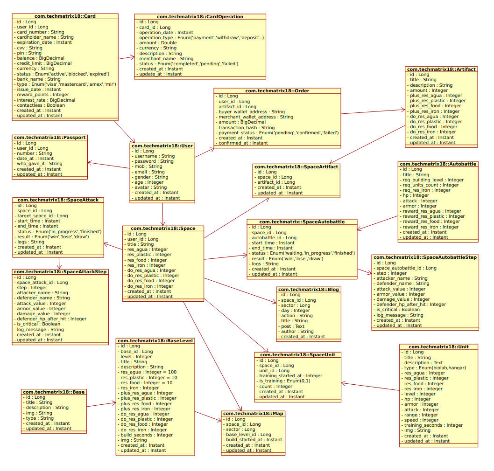
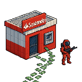
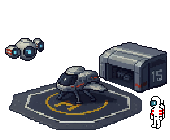
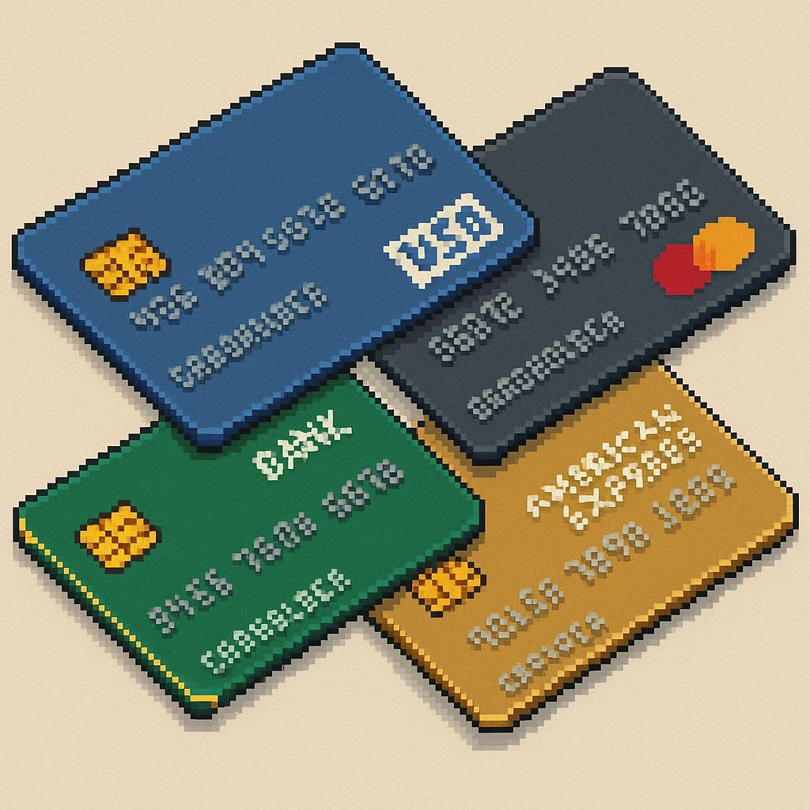
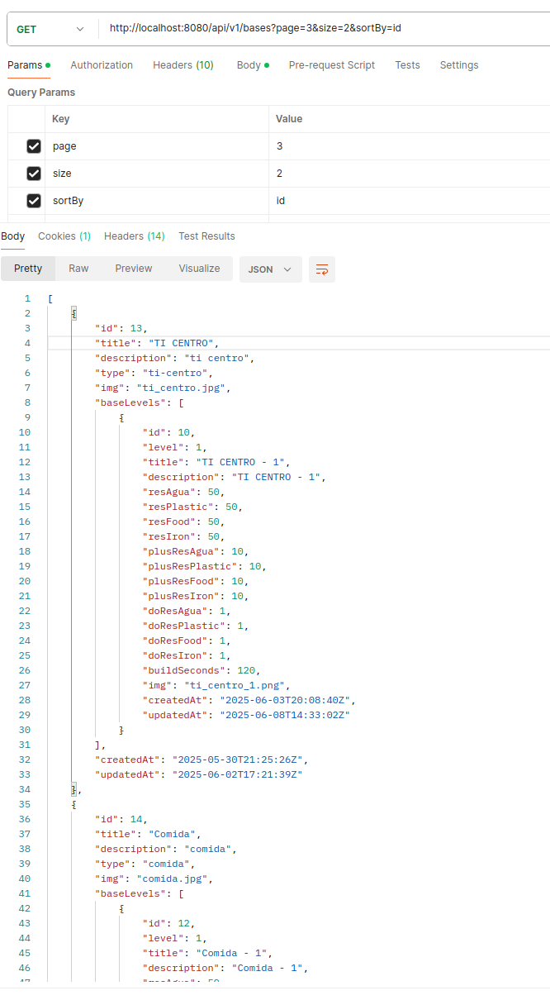
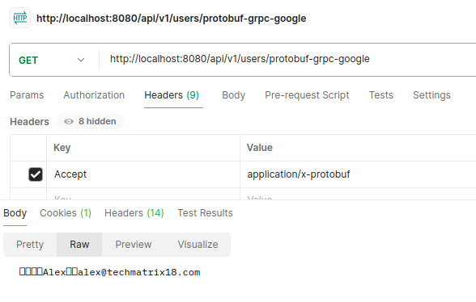
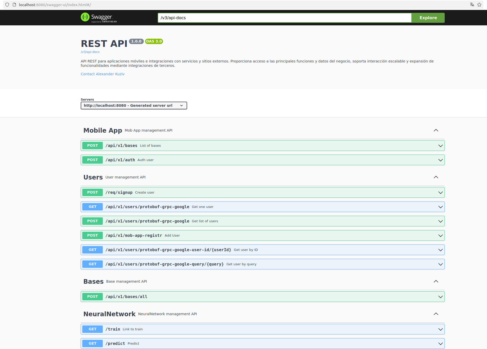

# El proyecto: java-in-docker

Yo como Arquitectador =) pinté esta eschema UML para mejor entender el proyecto con sus tablas

en base de datos. 

Varios pantillas del proyecto bajo

Tu puedes pagar y comprar nuevos artifactos desde tu tarjeta o USDT (Tether)... Para este en mi proyecto yo utilizo Web3J...

    
    
    
    
    
    
    
    

### En Postman

 

<!--img src="./src/main/resources/mystatic/images/protobuf/1000000106.png" width="170" /-->

### Swagger - OpenApi - REST API 

y más

Pronto será más... 

