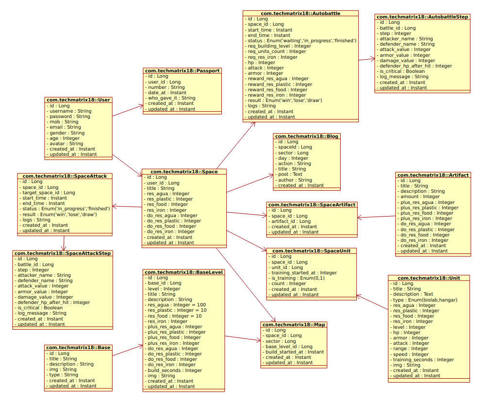
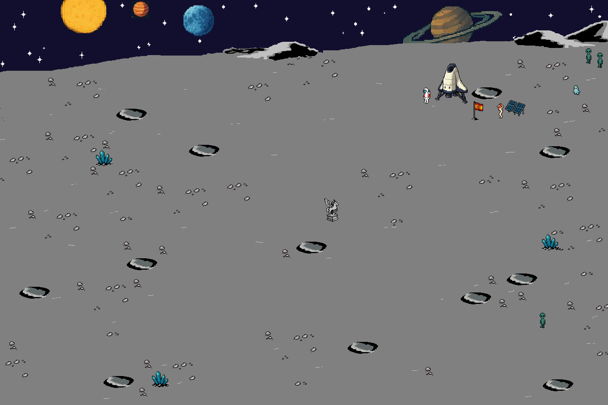
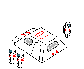
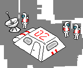
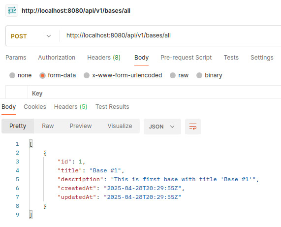

# El proyecto: java-in-docker

Yo como Arquitectador =) pinté esta eschema UML para mejor entender el proyecto con sus tablas

en base de datos. 

Varios pantillas del proyecto bajo

    
    
    
    
    

### En Postman

Pronto será más... 

